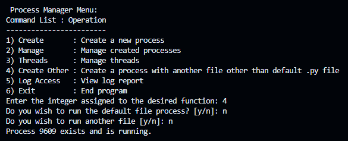

# CMPSC 472 Project: Advanced Process Manager
___

CMPSC 472 Project #1

Instructor: Janghoon Yang

Advanced Process Managment

Student Name: Joshua Murillo

## Project Overview:

This project was assigned as an assignment from my CMPSC 472, Operating Systems class. The purpose of this project is to design and implement an advanced Process Manager. This Project Manager will emphasize process synchronization and allow users to interact with the Project Manager through the creation, management, and synchronization of a multithreaded environment. The Project Manager should provide these functions to a user via a command-line user interface that uses system calls or system call-like functions provided by various libraries for the processing and threading control. This repository is to include the source code for the Project Manager and a Project report listed as the readme of this repository.

## Implimentation Process:
When designing this process manager, I looked at the individual requirements and looked for various Python libraries that showcased similar functionalities to what the project's requirements described. The libraries that stuck out the most to me were the os, threading, multiprocessing, subprocess, and pstil python libraries. These libraries showcased examples of functionalities that greatly resembled the related topics that I was tasked with showing in my process manager implementation despite the limitations of the Python language with regard to process management. That said, when testing some of these libraries' functionalities, I ran into a number of issues with my initial Windows development environment. Some libraries, such as the os and psuitl libraries, could not access all of their functions as they were not compatible with the Windows environment system. I attempted to design my process manager implementation in both Google Colab and Jupiter notebooks environments but fell into some issues with trying out the libraries there as well. In the end, I found success when attempting to develop the software on a Linux machine where all of the libraries that I wanted to incorporate into my software were available with full functionality. 

## Implimented Features:
The following describe the extent of the implimentations of the concepts that were expected to be implimented into my process manager software.

### 1. Process Creation:
Process creation is initiated in the **create_and_start_process** function. It allows the program to start new processes, either with or without threading depending on what the user desires. By default, the 'Create' function create a process based on a build-in **worker_function**. This function will, if the 'default.py' script is discoverable, create a process based on the contents of that program as a subprocess. Otherwise, if the external files are not found, the **worker_function** will fall back to the built in process representation comprized of a sleep function to simulate the process running and doing work. Users can choose to create processes with the default settings or specify a custom Python script file with the option to use threading or not.

### 2. Process Management:
The ProcessManager class includes functions for managing processes, such as listing running processes, viewing process information of running processes, and terminating running processes. Users can list running processes, and view information about a specific process, including process ID, (PID), parent process ID, (Parent PID), and its current status. In this sub-menu, processes that are currently running can also be terminated based on their process IDs.

### 3. Thread Support:
This process manager demonstrates support for threading within processes. Threading is simulated in the **create_and_start_process** function where a variable is assigned to a randomly generated value representing the amount of items/data that a process may want to manipulate. This process, if the user specifies, can then be created to use this variable to create threads to acquire use, and release resources by implementing Process Synchronization which will be described further below.

### 4. Inter-Process Communication (IPC):
Inter-Process Communication, also known as IPC, is showcased through the use of Python's multiprocessing. Queue in the queue attribute of the ProcessManager class as a variable, thread_message_queue. The process manager showcases **send_message** and **receive_message** functions that facilitate communication between threads using the thread_message_queue variable. This feature showcases a simulation of the ability of threads in a process being able to send data from one thread to another. The send and receive notices can be found in the logger document when running the software. Aside from this simulation, the **create_and_start_process** function also showcases a concept of IPC, as the ability to create independently running subprocesses using pipes also demonstrates processes communicating to one another to call other processes. 

### 5. Process Synchronization:
Inspired by the well-known producer and consumer problem, process synchronization is implemented using the **synchronize_threads** function. The producer and consumer threads use semaphores (mutex, empty, and data) to coordinate access to the shared buffer list, showcasing thread synchronization techniques in order to work on data tasks that were randomly generated by the **create_and_start_process** function when the thread-related process was created without the threads interrupting each other in a destructive manner.

### 6. Command-Line Interface (CLI):
This process manager incorporates a command-line interface using the argparse module provided by Pycharm. Users can start the Process Manager by running the script with the --begin flag like, "python Process_Manager.py --begin". Since running various commands will re-initiate the program with every command invocation, the ProcessManager attribute variables will continuously reset. Therefore, it was decided to simply contain a single command to begin the program, where a command-line user interface traversed through various conditionals would then take control.

The CLI provides a menu-driven interface for users to interact with the Process Manager to create processes, manage to create threads, synchronize threads, and showcase some IPC-related functions. The CLI showcases the following interface after the --begin command is invoked:

 

### 7. Logging and Reporting:
Logging and reporting are integral parts of the program. The logging library is used to log various events and messages throughout the software. Log messages are written to a log file named **"process_manager.log"** and can be accessed using the "Log Access" menu option. The program allows users to view the log contents, which can be useful for monitoring threads and processes as well as viewing the inner workings of the threading processes and message-passing functions.

## How to run the Preocess Manager:
This repository showcases a number of files that relate to the process manager. That said, the only file that primarily matters is the Process_manager.py file. This file was designed to be able to work on its own using a built-in worker function to simulate the work of processes functioning with various time requirements. In order to run the project itself, there are two main methods of doing so.

**OPTION ONE:**

The best way to test the project is right in GitHub codespaces. The repository should first be forked, then the user can run a codespace to access a bash terminal where the user can input the initiating command line interface command, "python Process_Manager.py --begin". This command with initiate the class and prompt the user to begin using the process manager to create and monitor processes. This method is preferred as both the main program and the optional subprocess simulating programs are all in the same directory, so they are easy to locate and use.

**OPTION TWO:**

The other way of using the process manager is by downloading the Process_Manager.py file to your local machine and running it in a Linux terminal. To do this, you will need to open the terminal and verify that you have Python 3 and pip installed. If not, you will need to acquire them. Once you have Python and pip, do:

pip install --upgrade pip

pip install psutil

Once complete, in the terminal, change to the directory where the Process_Manager.py file is located. Then, similar to before, you can type "python3 Process_Manager.py --begin". Keep in mind that some Linux terminals will need to have 'python3' specified before the command instead of just 'python'. Now you should be able to run the project just as you would in codespaces with one difference. If you want to use the optional subprocess simulating programs, you will need to also download them and keep note of what directory they are in. If this is done, then when prompted, the user can select "Create Other" from the command line menu and if desired, will be able to input either "path/to/default.py" or "path/to/other_process.py" to create a subprocess based on either of the files. **NOTE:** The way the Process_Manager.py file is set up, you can write the path to any .py file to create a process based on the Python file, it may not work correctly for other files. It should still function and create a pseudo process out of that call though, so long as the directory exists as a .py file since it is creating it as a subprocess. 

Of these two methods, the safest way to test this code out for yourself is through codespaces.

## Process Manager Feature Testing:
### 1. Testing Process Creation:

The following shows the default creation of a process without threading:

### 2. Testing Process Management:
The following showcases the various functions of the management of processes from the 'Manage' menu option:

The following shows the listing of processes:

The following shows the viewing of the created process:

The following shows the termination attempt of a registered process:

### 4. Testing Inter-Process Communication (IPC):
The following shows various versions of the process creation using pipes to create processes from external .py files:

Using default.py to create a process: &nbsp;&nbsp;&nbsp;&nbsp;&nbsp;&nbsp;&nbsp;&nbsp;&nbsp;&nbsp;&nbsp;&nbsp;&nbsp;&nbsp;&nbsp;&nbsp;&nbsp;&nbsp;&nbsp;&nbsp;&nbsp;&nbsp;&nbsp;&nbsp;&nbsp;&nbsp;&nbsp;&nbsp;&nbsp;&nbsp;&nbsp;&nbsp;&nbsp;&nbsp;&nbsp;&nbsp;&nbsp;&nbsp;&nbsp;&nbsp;&nbsp;&nbsp; Using other_process.py to create a process:
 

Using build-in sleep function simulating work: &nbsp;&nbsp;&nbsp;&nbsp;&nbsp;&nbsp;&nbsp;&nbsp;&nbsp;&nbsp;&nbsp;&nbsp;&nbsp;&nbsp;&nbsp;&nbsp;&nbsp;&nbsp;&nbsp;&nbsp;&nbsp;&nbsp;&nbsp;&nbsp; Using a file name that does not exist:
 

The following simulates IPC functions with respect to message passing:

Logger output showing the inner working of the message pass:

### 5. Testing Thread Support and Process Synchronization:
The following showcases the process synchronization between threads whenever a process is made with the flag to use threads found in the 'Threads' menu select and in the 'Create Other' menu select:

Logger output showing the inner working of the process synchronization:

### 6. Testing Command-Line Interface (CLI):
The following shows the command-line interface right after the Process_Manager.py file is invoked with the **'python Process_Manager.py --begin'** command:

### 7. Testing Logging and Reporting:
The following shows the CLI menu option for showing the log file contents:

## Project Results:
